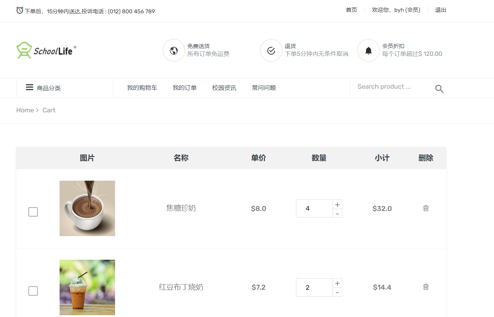
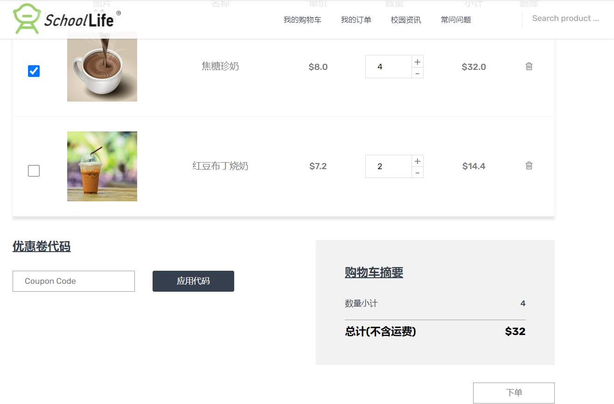
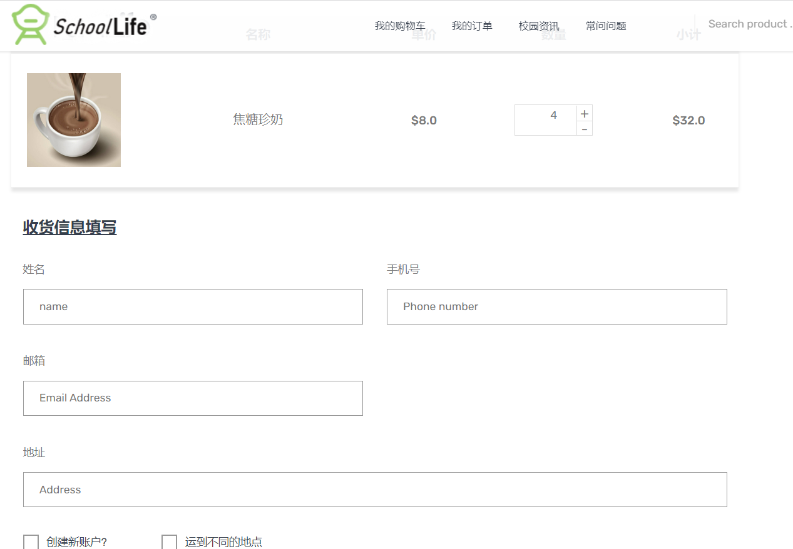
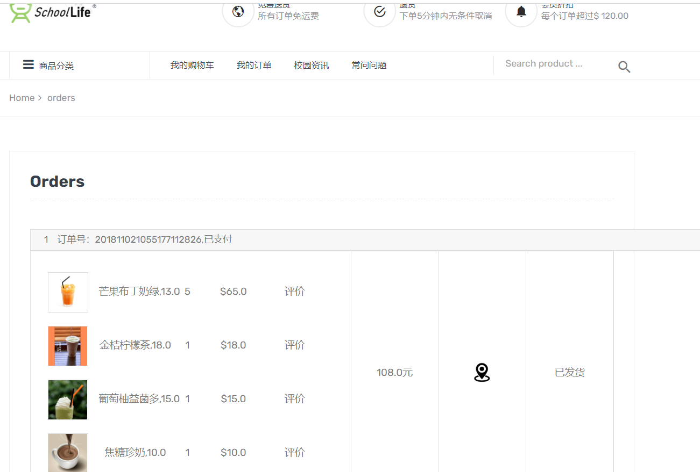
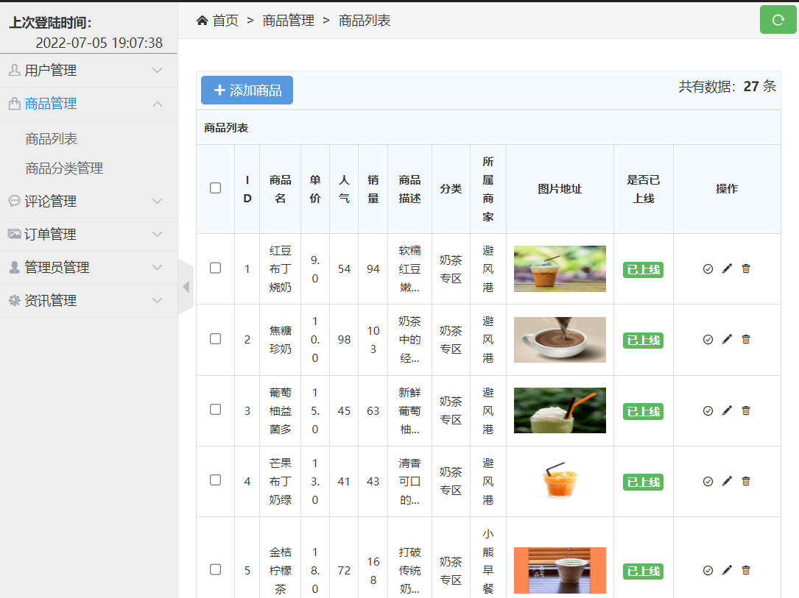
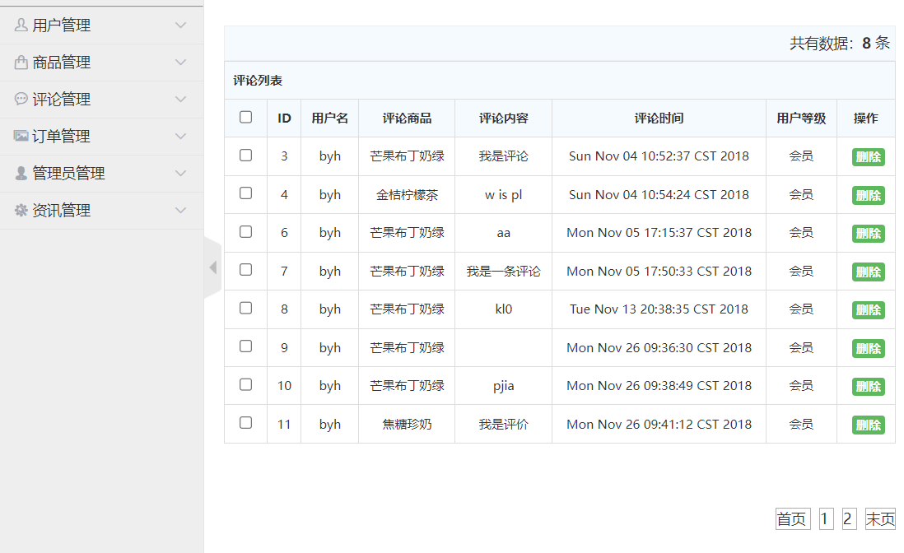
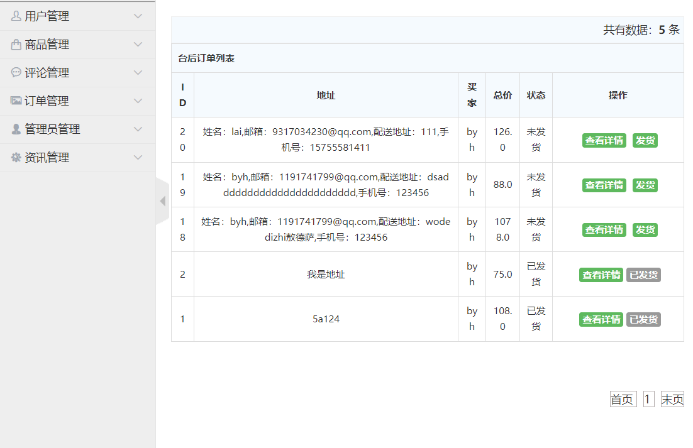
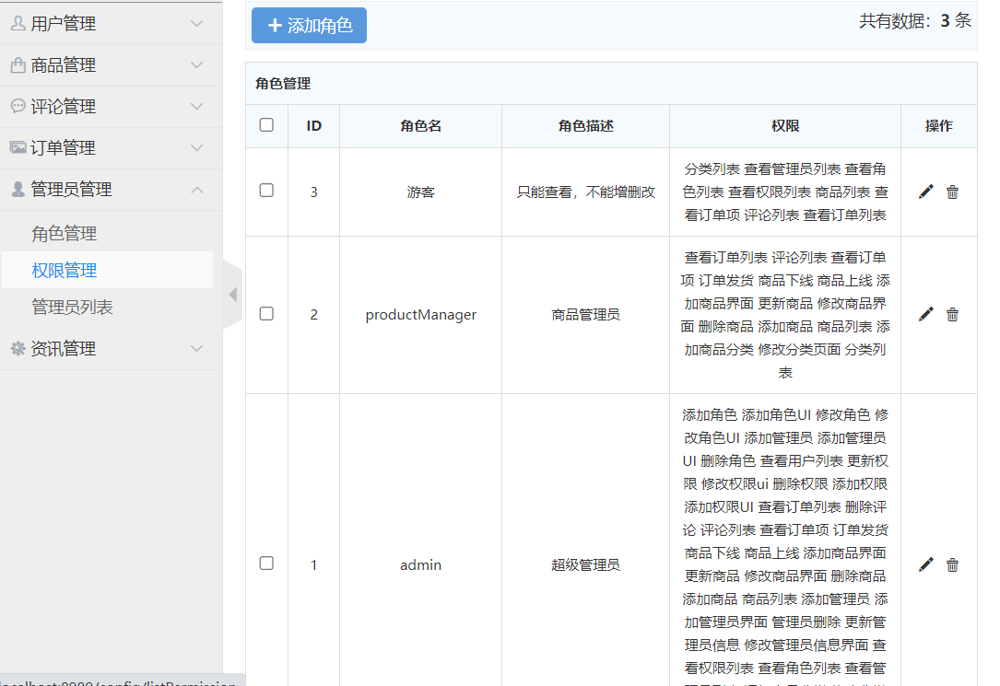
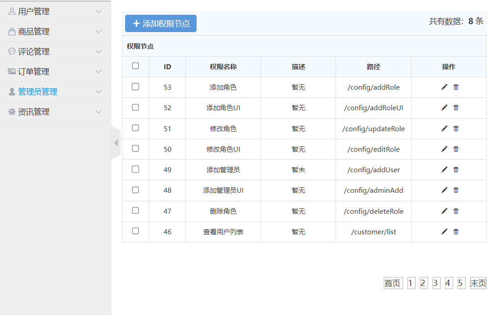
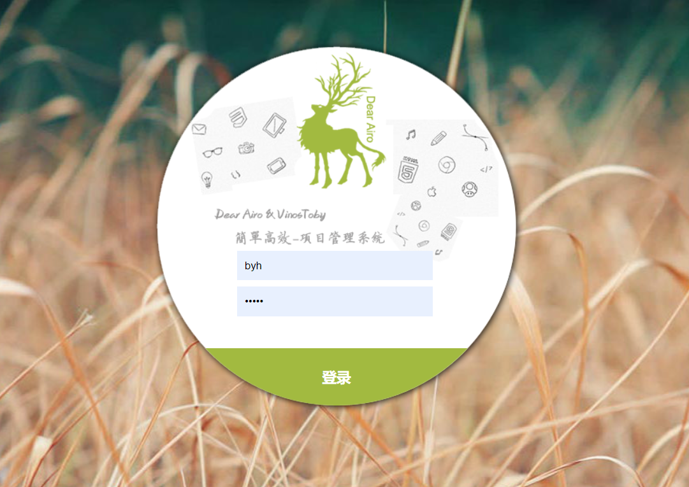

### 作者QQ：1556708905(支持修改、 部署调试、 支持代做毕设)

#### 支持代做任何毕设论、接网站建设、小程序、H5、APP、各种系统等

**毕业设计所有选题地址 [https://github.com/zhengjianzhong0107/allProject](https://github.com/zhengjianzhong0107/allProject)**

**博客地址：[https://blog.csdn.net/2303_76227485/article/details/128701556](https://blog.csdn.net/2303_76227485/article/details/128701556)**

**视频演示：[https://www.bilibili.com/video/BV1XV411u7BW/](https://www.bilibili.com/video/BV1XV411u7BW/)**

## 基于ssm的校园网上订餐系统(源代码+数据库)

## 一、系统介绍

本项目分为管理员与普通用户两种角色

- 前台模块
  
  前台主要功能有：用户注册、用户登录、我的购物车、我的订单、商品评论、校园资讯、修改密码
- 后台模块
  
  后台主要功能有：用户管理、商品管理、订单管理、评论管理、资讯管理等

## 二、所用技术

- 后端使用Java+ssm+MyBatis+MySQL+shiro
- 前端使用jsp+bootstrap

## 三、环境介绍

基础环境 :IDEA/eclipse, JDK 1.8, Mysql5.7,Maven，tomcat8.0

所有项目以及源代码本人均调试运行无问题 可支持远程调试运行

## 四、页面截图

## 五、浏览地址

后台超级管理员：
http://localhost:8989/login

用户名:小白    密码:adminadmin

前台地址:
http://localhost:8989/fore/foreIndex

用户名:byh   密码:12345

## 六、安装教程

1. 使用Navicat或者其它工具、在mysql中创建对应名称的数据库、并导入项目的sql文件；
2. 使用IDEA/Eclipse导入项目，若为maven项目请选择maven，导入成功后请执行maven clean;maven install命令
3. 修改resource里面的jdbc.properties里面的数据库配置
4. 将项目加入到tomcat容器里面，启动项目 

 

**接毕业设计和论文**
